# CareerForge

**AI-powered job search pipeline** — discover, evaluate, apply, and prepare for your next role from a single dashboard.

Built with Next.js 16, Prisma (SQLite), and pluggable LLM providers (Claude, OpenAI, Gemini, Ollama).

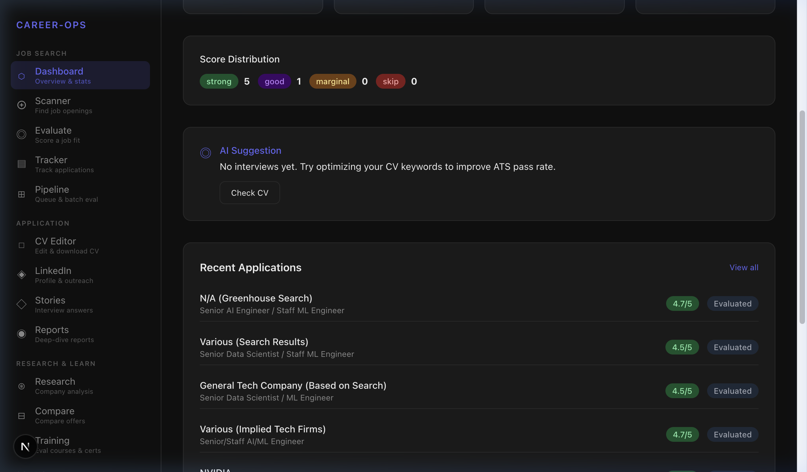

---

## ✨ Features

### Phase 1: Find Jobs

<details>
<summary><b>🔍 Scanner</b> — Search for jobs across 54+ company portals</summary>

Load 54+ default portals (Anthropic, OpenAI, Google, NVIDIA, etc.), then search by role. Results show H1B status, with "View Job" and "Add to Queue" actions.

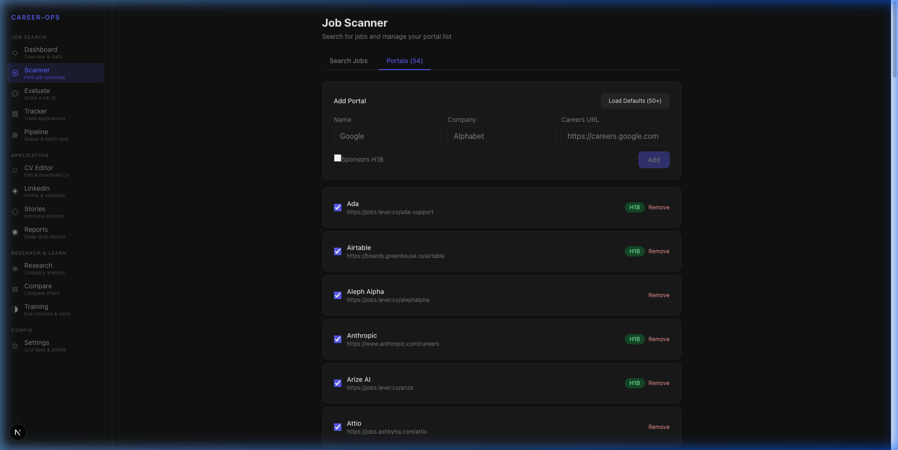
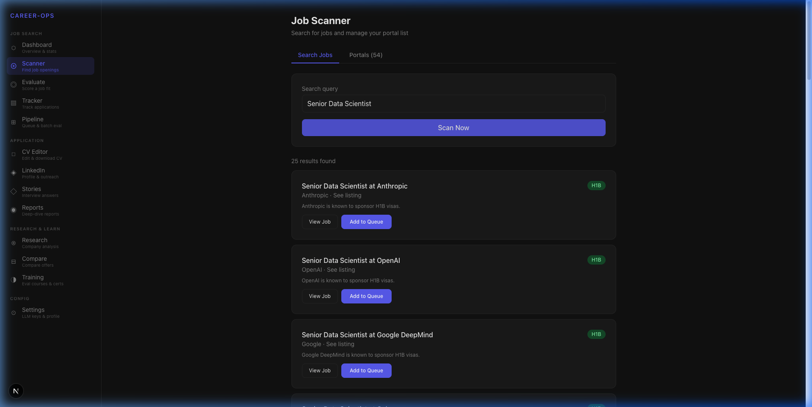

</details>

<details>
<summary><b>◎ Evaluate</b> — AI-score any job against your profile</summary>

Paste a job URL or full description. The AI returns a match score (1–5), tier classification, H1B status, fit analysis, keyword gaps, and tailored CV bullets you can apply directly.

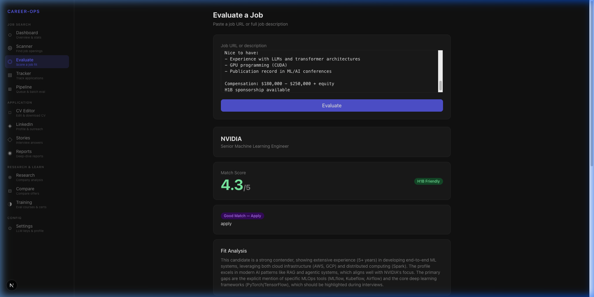
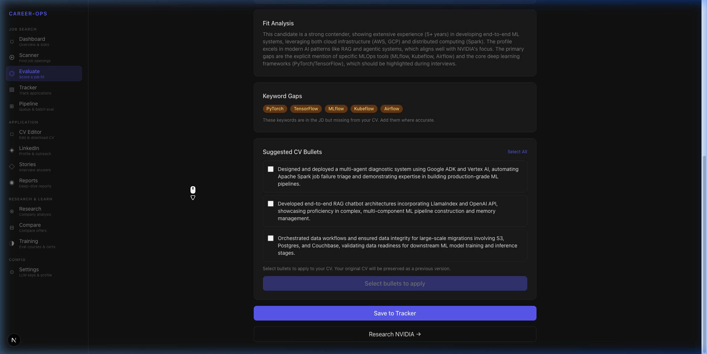

</details>

<details>
<summary><b>⊞ Pipeline</b> — Batch-evaluate queued job URLs</summary>

Queue multiple job URLs and run batch evaluation. Track pending vs. processed items in real time.

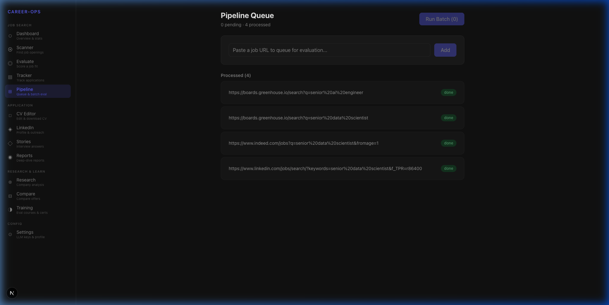

</details>

<details>
<summary><b>▤ Tracker</b> — Manage all applications in one place</summary>

Track every application with score, tier, status, H1B flag, and one-click apply. Filter by company, role, or status.

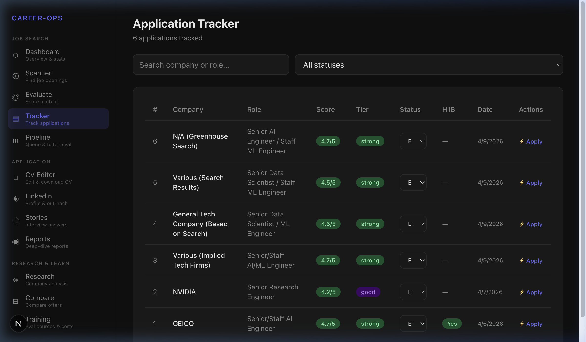

</details>

### Phase 2: Apply

<details>
<summary><b>⚡ Auto-Apply Methods</b> — Submission strategies</summary>

Choose between two execution strategies for submitting your application:
- **Manual (✅ Stable / Default):** The system generates your cover letter, answering screening questions based on your profile, and bundles your AI-tailored CV. You simply copy and paste the generated materials into the job form. Recommended for everyone.
- **Claude Computer Use (⚠️ Work in Progress):** Fully automated browser interaction where Claude navigates the job site and fills the form for you. This is an experimental feature and requires a compatible Anthropic API key. Expect occasional API rate limits or visual parsing errors.

</details>

<details>
<summary><b>◻ CV Editor</b> — Markdown editor with AI-powered ATS Audit</summary>

Edit your CV in markdown. Run ATS Audit to get a compatibility score (0–100), flagged issues, bullets missing metrics, and actionable suggestions. Download as PDF or print.

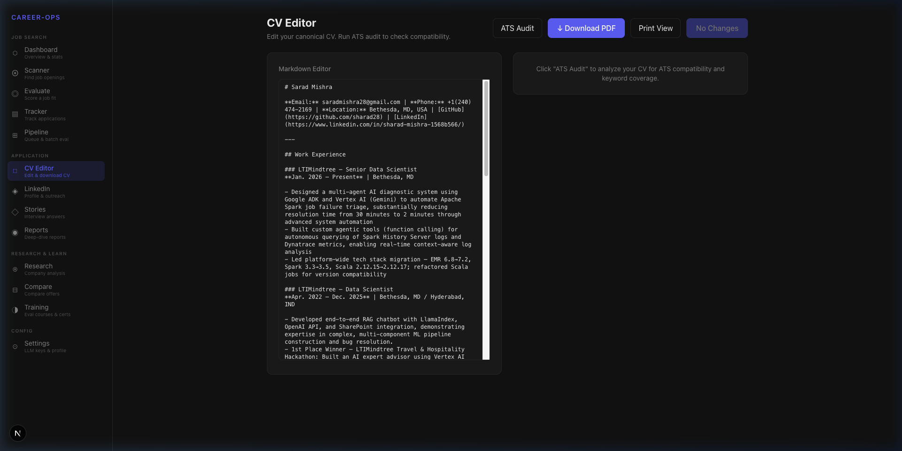
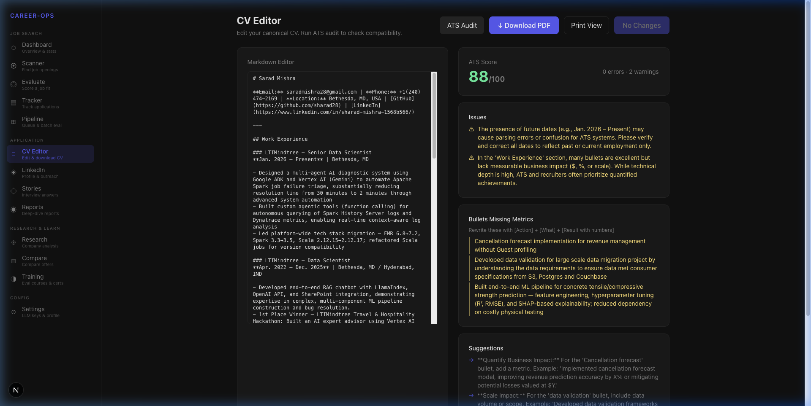

</details>

<details>
<summary><b>◈ LinkedIn</b> — Profile optimizer and post generator</summary>

Two tabs: optimize your LinkedIn profile for recruiter discovery, or generate engagement posts by category (Lesson Learned, Industry Insight, Hot Take, etc.).

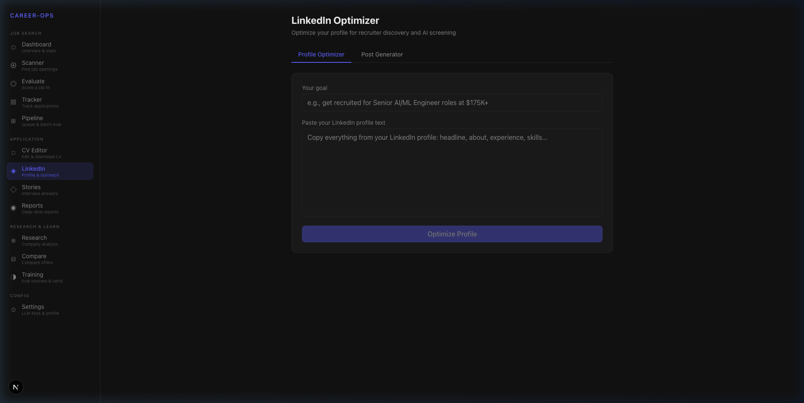

</details>

<details>
<summary><b>◇ Stories</b> — STAR+R interview answer bank</summary>

Build a repository of interview stories using the STAR+R framework (Situation, Task, Action, Result, Reflection). Tag and filter for quick prep.

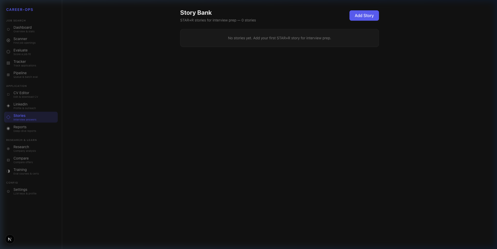

</details>

<details>
<summary><b>◉ Reports</b> — Saved evaluations and LinkedIn outreach</summary>

Browse all past evaluations with scores and dates. Click any report to view full details and generate LinkedIn outreach messages for hiring managers, recruiters, and peers.

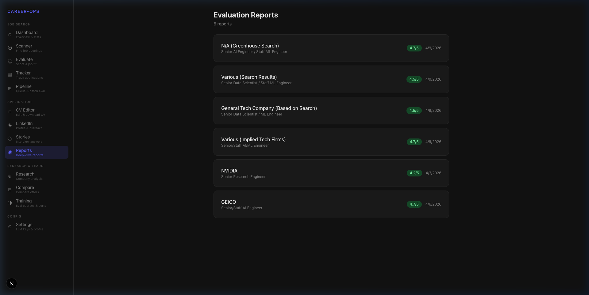

</details>

### Phase 3: Research & Learn

<details>
<summary><b>⊛ Research</b> — 6-axis company deep dive</summary>

Enter a company name and role to get AI analysis across 6 axes: AI Strategy, Recent Moves, Engineering Culture, Probable Challenges, Competitors & Positioning, and Your Angle.

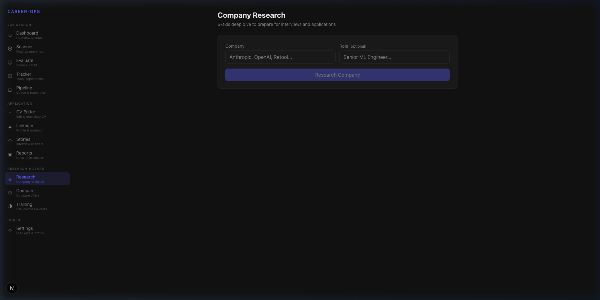

</details>

<details>
<summary><b>⊟ Compare</b> — Side-by-side offer comparison</summary>

Select 2–5 evaluated reports and compare across 10 weighted dimensions (North Star, CV Match, Comp, Growth, Remote, Tech Stack, etc.). Get a Best Fit recommendation with pros/cons.

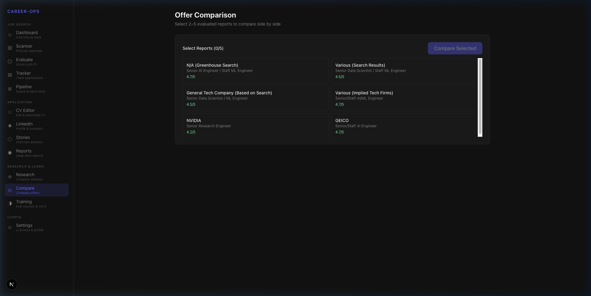

</details>

<details>
<summary><b>◑ Training</b> — Course & certification evaluator</summary>

Enter a course or certification name and get an AI-powered ROI verdict: DO IT, DO WITH TIMEBOX, or SKIP — with dimension scores and action plans.

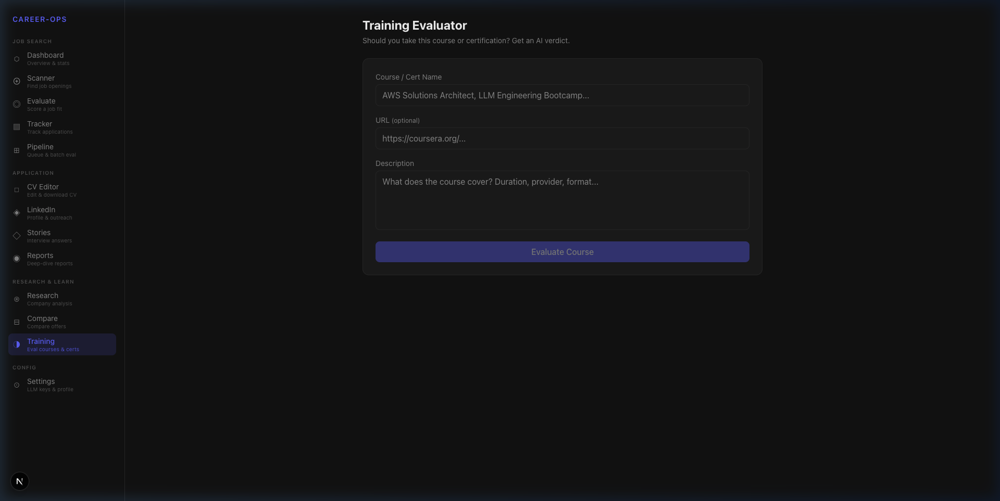

</details>

---

## 🚀 Getting Started

### Prerequisites

- Node.js 18+
- npm or yarn
- (Optional) [Ollama](https://ollama.ai) for free local AI

### 🛠️ Step-by-Step Setup

**1. Clone the repository**
```bash
git clone https://github.com/sharad28/Career-Forge.git
cd Career-Forge
```

**2. Install dependencies**
```bash
npm install
```

**3. Configure Environment Variables**
Copy the example environment file:
```bash
cp .env.example .env
```
Open `.env` in your editor. You must provide a 32-character random string for `ENCRYPTION_KEY` to securely encrypt your API keys locally. You can generate one quickly in your terminal by running:
```bash
openssl rand -base64 32
```
Leave `DATABASE_URL` as `file:./dev.db` unless you are using an external database.

**4. Initialize the Database**
Generate the Prisma typed client and push the schema to create your local SQLite database:
```bash
npx prisma generate
npx prisma db push
```

**5. Start the Application**
```bash
npm run dev
```

**6. Complete Onboarding**
Open [http://localhost:3000](http://localhost:3000) in your browser.
1. Navigate to the **Settings** menu.
2. Fill out your background, target roles, and salary expectations.
3. Plug in your preferred LLM API Key (or ensure Ollama is running locally if you chose the free alternative).
4. *Important:* Make sure to set your default Apply Method (Manual is highly recommended).

### Environment Variables

| Variable | Required | Description |
|----------|:--------:|-------------|
| `DATABASE_URL` | ✅ | Path to SQLite database (e.g. `file:./dev.db`) |
| `ENCRYPTION_KEY` | ✅ | 32-char key for encrypting API keys at rest |

> **Note:** LLM provider settings (API key, model, base URL) are configured through the Settings UI and stored encrypted in the local database.

---

## 🏗️ Architecture

```
careerforge/
├── app/                    # Next.js App Router pages
│   ├── page.tsx            # Dashboard
│   ├── scan/               # Job Scanner
│   ├── evaluate/           # AI Job Evaluator
│   ├── tracker/            # Application Tracker
│   ├── pipeline/           # Batch Queue
│   ├── cv/                 # CV Editor + ATS Audit
│   ├── linkedin/           # LinkedIn Optimizer
│   ├── stories/            # STAR+R Story Bank
│   ├── report/             # Evaluation Reports
│   ├── research/           # Company Research
│   ├── compare/            # Offer Comparison
│   ├── training/           # Course Evaluator
│   ├── settings/           # Profile & LLM Config
│   ├── apply/              # Auto-Apply Workbench
│   └── api/                # API Routes (one per feature)
├── components/             # Shared UI components (Sidebar)
├── lib/                    # Core business logic
│   ├── ats/                # ATS adapters (Greenhouse, Lever, Ashby)
│   ├── computer-use/       # Claude Computer Use agent
│   └── llm.ts              # LLM provider abstraction
├── prisma/                 # Database schema & migrations
│   ├── schema.prisma
│   └── dev.db              # SQLite database
└── docs/demo/              # Demo screenshots
```

### Tech Stack

| Layer | Technology |
|-------|-----------|
| Framework | Next.js 16 (App Router, Turbopack) |
| Database | SQLite via Prisma ORM |
| AI | Claude, OpenAI, Gemini, Ollama (pluggable) |
| Styling | CSS (dark theme) |
| Markdown | `marked` for CV rendering |
| ATS | Custom adapters for Greenhouse, Lever, Ashby APIs |
| Auto-Apply | Claude Computer Use (browser automation) |

### AI Provider Support

| Provider | Models | Cost |
|----------|--------|------|
| **Ollama** (local) | gemma4, llama3, mistral, etc. | Free |
| **Claude** (Anthropic) | claude-sonnet-4-6, claude-opus-4-6, claude-haiku-4-5-20251001 | API pricing |
| **OpenAI** | gpt-4o, gpt-4o-mini, gpt-4-turbo | API pricing |
| **Gemini** (Google) | gemini-2.0-flash, gemini-1.5-pro | API pricing |

---

## 📊 Demo Results

Live tests conducted with Ollama `gemma4:latest` (local, free):

| Test | Result |
|------|--------|
| **Scanner Search** | 54 portals loaded → "Senior Data Scientist" → **25 results** (Anthropic, OpenAI, Google DeepMind) |
| **Job Evaluation** | NVIDIA Sr. ML Engineer → **4.3/5** score, 5 keyword gaps, 3 tailored CV bullets |
| **ATS Audit** | CV scored **88/100**, 2 warnings, 3 bullets flagged for missing metrics |
| **Tracker** | 6 applications tracked, scores 4.2–4.7/5 |

---

## 🔐 Security

- **Local-first**: All data stored in local SQLite database
- **Encrypted API keys**: Provider keys encrypted with `ENCRYPTION_KEY` before storage
- **No external telemetry**: Keys only sent to the configured LLM provider
- **No cloud dependency**: Works fully offline with Ollama

---

## 📄 License

MIT
